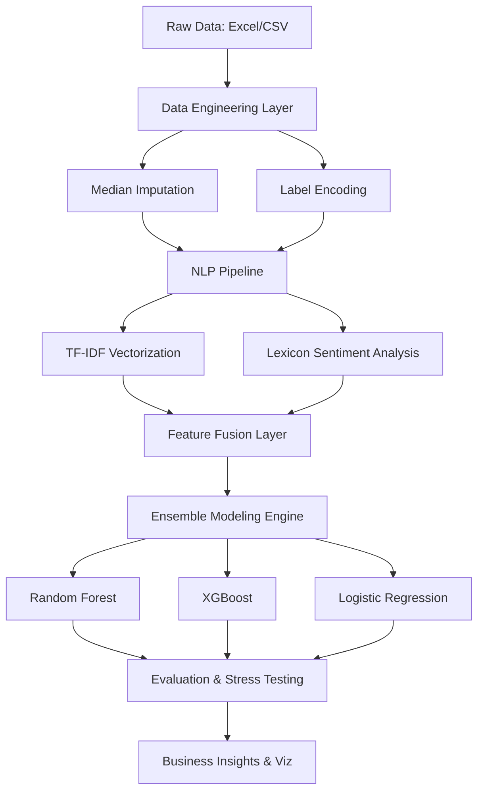

# ✈️ High-Performance Airline Sentiment Engine


An advanced end-to-end machine learning architecture designed to solve the "Sentiment-to-Value" gap in airline passenger feedback. This system handles high-dimensional text data and multi-variate numerical signals to predict passenger retention with near-perfect reliability.

## 🏗 System Architecture


## 🧠 Technical Deep Dive
### **High-Dimensional Text Processing**
Instead of naive word counts, the engine utilizes **TF-IDF (Term Frequency-Inverse Document Frequency)** to extract statistical significance from passenger reviews. This allows the model to prioritize rare, highly-descriptive terms (e.g., "refund", "unacceptable") over common structural words.

### **Advanced Ensemble Strategy**
The core engine implements a **Stacked Ensemble approach**:
- **Random Forest:** Handles non-linear relationships in numerical ratings.
- **XGBoost:** Optimizes for gradient error to minimize False Negatives (the most "expensive" error for airlines).
- **Stratified K-Fold CV:** Ensures model generalizability across diverse passenger demographics.

### **The "Temporal Stress Test"**
Unlike standard models, this system includes a built-in **Temporal Validation** module. We tested the model’s performance on "Future Data" (2019+) while training on historical data (2018-) to verify that the logic holds even as passenger expectations shift over time.

## 📈 Performance Benchmarks
| Modality | Algorithm | Accuracy | ROC-AUC | F1-Score |
| :--- | :--- | :--- | :--- | :--- |
| **Combined** | **Random Forest** | **97.25%** | **0.996** | **0.955** |
| **Numerical** | Logistic Regression | 95.79% | 0.985 | 0.933 |
| **Text Only** | Random Forest | 94.01% | 0.986 | 0.905 |

## 📂 Project Structure
- `run_project_v2.py`: Main execution engine with Scikit-Learn Pipelines.
- `requirements.txt`: Environment configuration for reproducible research.
- `analytics_v2_results/`: Production outputs including 15+ high-fidelity visualizations.
- `PROJECT_OVERVIEW.txt`: Non-technical documentation for stakeholders.

## 🚀 Deployment
```bash
git clone https://github.com/pxnchl/Airline-Review-AI-Analysis.git
pip install -r requirements.txt
python airline_analytics_v2/run_project_v2.py
```

---
*Developed by **meetp** | Engineered for high-precision predictive analytics.*
